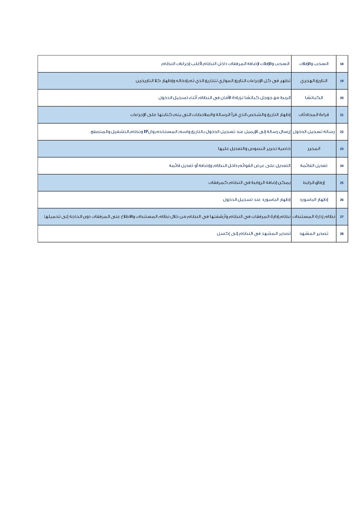
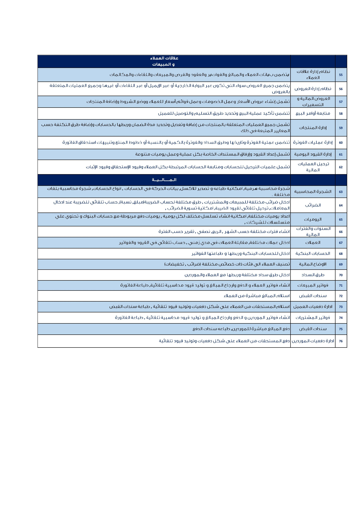
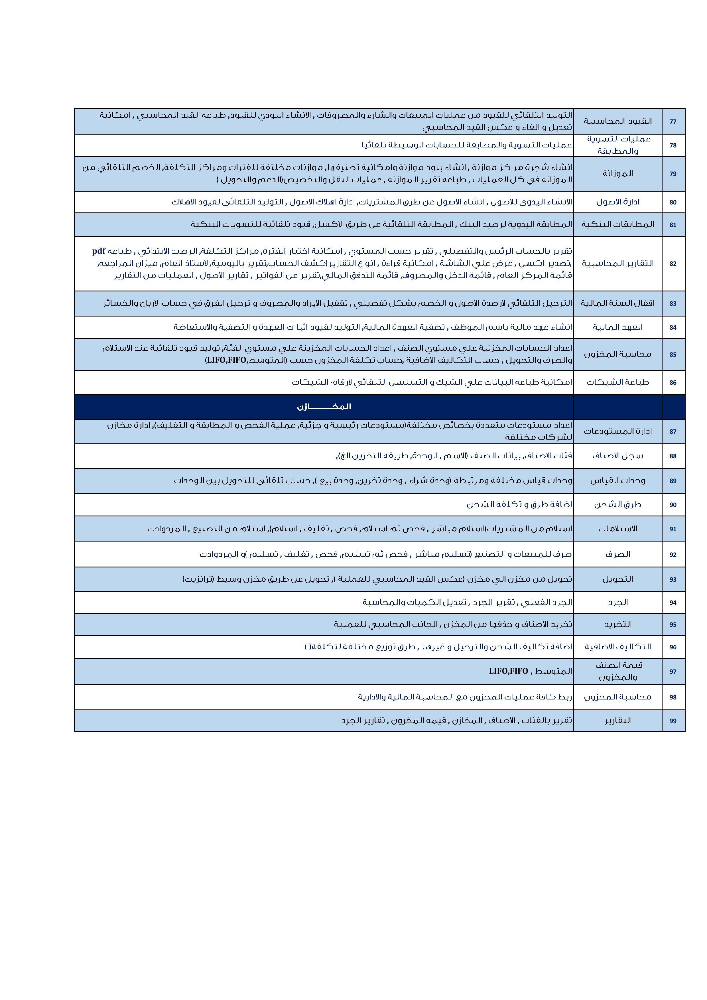
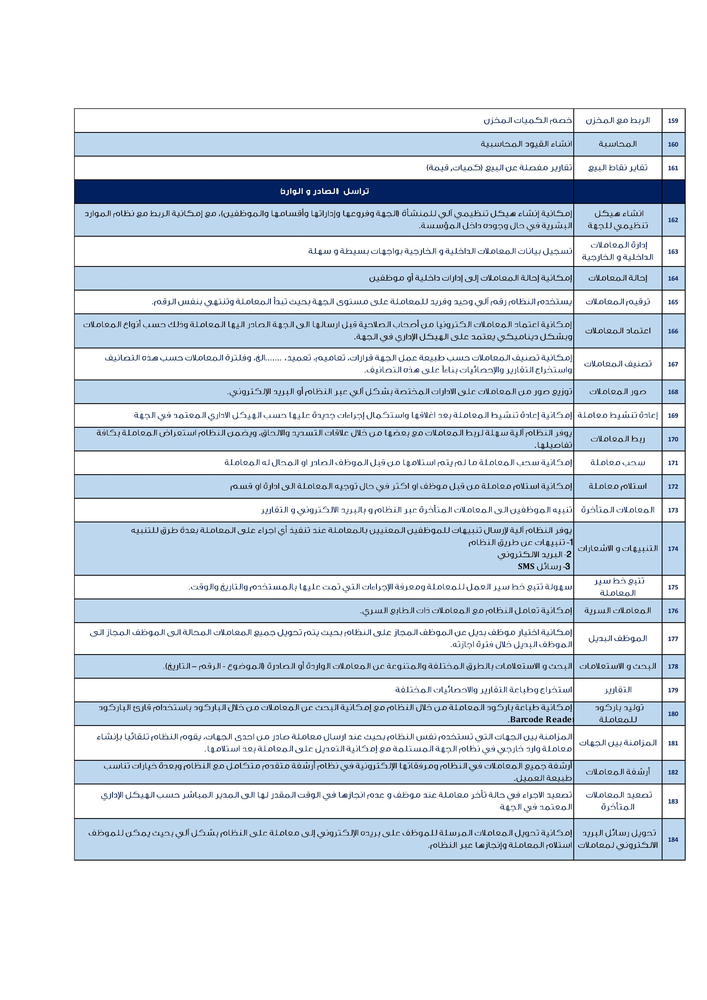
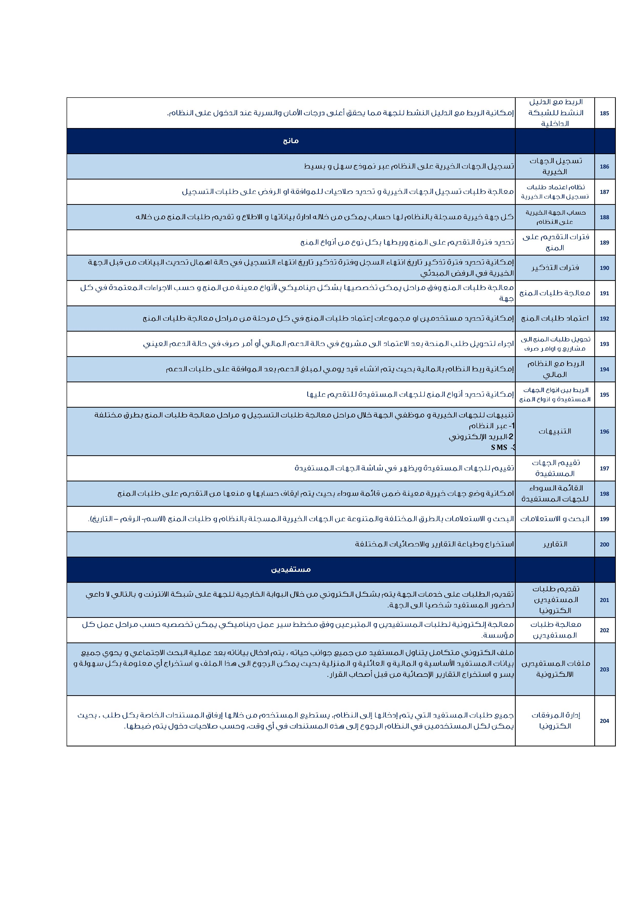
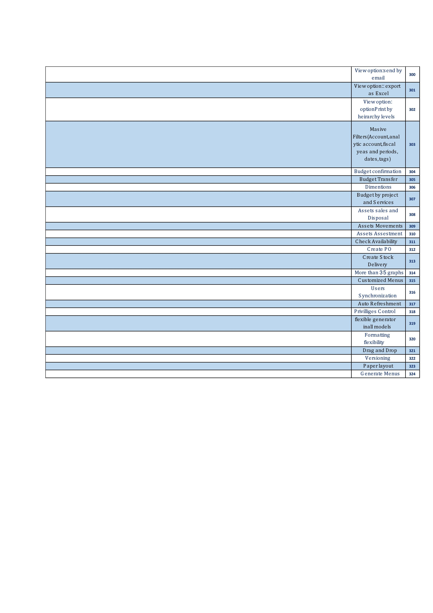

#  [Expert Co. Ltd.](http://exp-sa.com/)

> A limited liability company with distinguished cadres and long experience serving the fields of information and communication technology in a steady and renewed pace, with audited standards and distinguished international experiences.
It meets customer aspirations and needs.


## Odex Applications:
1.  Odex Base 
2.  Odex Human Resources
3.  Odex Accounting
4.  Odex Transactions
5.  Odex sales and crm
6.  Odex Purchases
7.  Odex Projects
8.  Odex Stocks and warehouses
9.  Odex Pos
10. Odex Portal<br/><br/>
## Installing / Getting started
##### Initial Configuration
```shell
sudo git clone https://github.com/expsa/ODEX.git
sudo pip3 install -r ODEX/server/requirements.txt
```
##### Deploying / Launching Odex
```shell
cd ODEX
/usr/bin/python3 server/odoo-bin -c odoo-server.conf
```

### For fast installation please use [Open-buffet.com](https://open-buffet.com) platform
### For more information can be review [Odoo Documentation](https://www.odoo.com/documentation/11.0/setup/install.html#source-install)
<br/>
<hr/>
<hr/>
<hr/>
<hr/>
<hr/>
<hr/>
<hr/>
<hr/>
<hr/>
<hr/>
<hr/>
<hr/>
<hr/>
<hr/>
<hr/><hr/>
